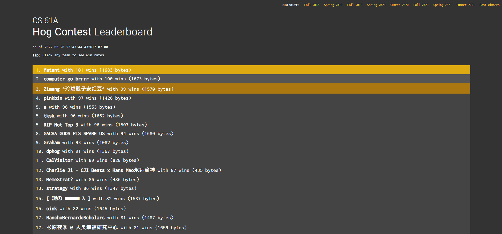

## What is this Project?
In UC Berkeley's introductory computer science course, COMPSCI 61A, we used to hold class-wide competitions each semester on an indeterministic game called "Hog".  
This game is about letting your current score, decided by the value your and your opponent's die roll to, race to a value faster.  
The rules of the game: https://inst.eecs.berkeley.edu/~cs61a/fa21/proj/hog/  
The rules of the contest: https://inst.eecs.berkeley.edu/~cs61a/fa21/proj/hog_contest/  
This repository holds the code that I used to compete into PR85 of all contestents.
To compete against the contestants during my semester, I followed the operations as described by the rules of the contest, which also addresses specific runtime and operation limitations of the code.

